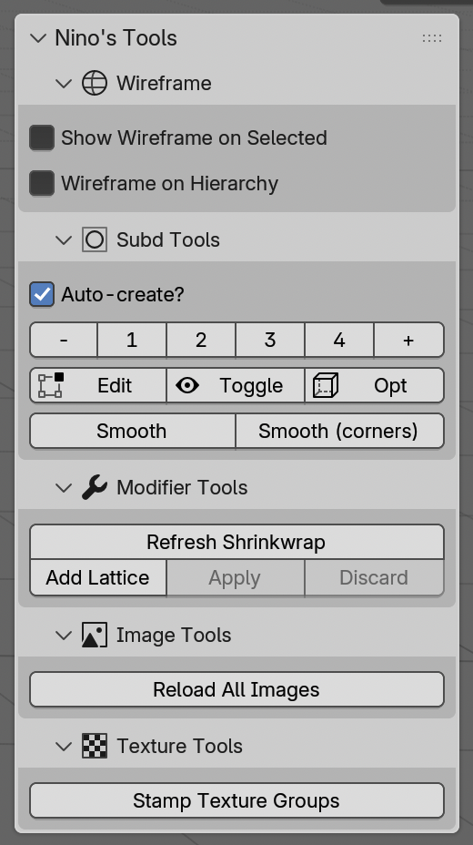

# Nino's Tools

A Blender addon with a collection of helpful modeling tools.

## Features

### Wireframe
- Automatically show wireframe overlay on selected objects
- Optionally extend wireframe to the entire hierarchy of selected objects

### Subd Tools
- Set or increment/decrement subdivision surface levels on selected objects
- Toggle edit-mode and on-cage preview
- Toggle subdivision visibility and optimal display
- Subdivide selected geometry (smooth or keep-corners mode)
- Optional auto-creation of subdivision modifiers on objects that don't have one

### Modifier Tools
- Refresh shrinkwrap modifiers by duplicating and re-applying them
- Lattice helper: quickly add a lattice deformer fitted to selected geometry, then apply or discard it
  - Supports local, world, and 3D cursor orientation for the bounding box
  - Adjust lattice divisions (U/V/W) directly from the redo panel

### Image Tools
- Reload all external images in the current file

### Texture Tools
- Stamp `texture_group` custom properties on objects based on their collection membership

### Smart Delete
- Context-aware delete mapped to Backspace in edit mode: deletes vertices in vertex mode, dissolves edges in edge mode, deletes faces in face mode

## Keyboard Shortcuts

| Shortcut | Action |
|---|---|
| Cmd+1 | Decrease subd level |
| Cmd+2 | Increase subd level |
| Cmd+3 | Cycle subd edit-mode preview |
| Cmd+Shift+D | Subdivide selection (smooth) |
| Backspace | Smart delete (edit mode) |

## Installation

1. Download this repository as a ZIP file (Code > Download ZIP on GitHub, or `git archive`)
2. Open Blender and go to Edit > Preferences > Add-ons
3. Click "Install..." and select the downloaded ZIP file
4. Enable the addon by checking the checkbox next to "Nino's Tools"
